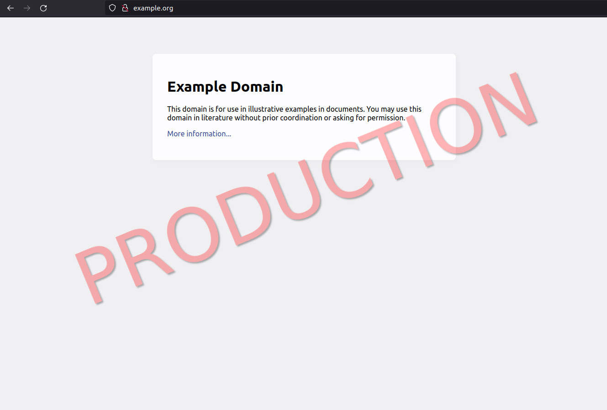

# watermark-pages

Watermark pages with a noticeable message.

## Installation

You can download this extension from the official browser sites:

- Chrome: [Watermark Pages](https://chrome.google.com/webstore/detail/watermark-pages/aglfemajaglojdoaddfgmchocnojeoed)
- Firefox: [Watermark Pages](https://addons.mozilla.org/en-GB/firefox/addon/watermark-pages/)

### Develpoment mode

For developing the extension:

- Clone this repo to a folder on your local machine.
- Follow the browser specific steps for:
  - Chrome
    - Go to [chrome://extensions](chrome://extensions) and enable **Developer mode**
    - Select **Load unpacked**, and select this repo
  - Firefox
    - Got to [Firefox debugging](about:debugging#/runtime/this-firefox)
    - Click **Load Temporary Add-on...** and select the `manifest.json` file

You can also download the `.crx` file from a release and `unzip` it, instead of cloning the repo.

## Usage

Once installed:

- Click the extension icon
- Click `Add Row`
- Enter the details of the watermark you want
- Click `Save` (retro!)

The pattern you enter will be matched against the page URL as a regex. If it matches, a watermark will be applied.

The screenshot above is what you get for `pattern: https://example.org/`, `watermark: PRODUCTION`, `color: red`
